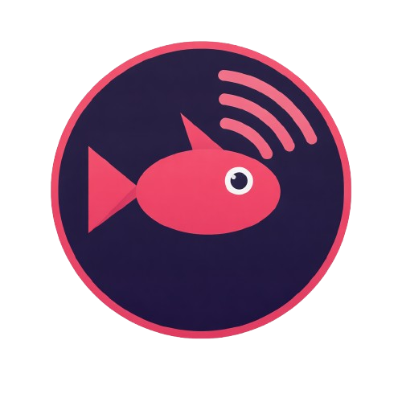

# TackleCast

<p align="center">
  
</p>

**A lightweight, low-latency capture card viewer for Windows.** No recording, no bloat — just your game on your screen.

Built for capture cards like the Genki ShadowCast, Elgato, AVerMedia, and other UVC-compliant devices. TackleCast uses [mpv](https://mpv.io/) under the hood for GPU-accelerated rendering, giving you crisp video with minimal latency.

## Features

- **GPU-accelerated video** via mpv — DirectX rendering via gpu-next
- **Low-latency audio passthrough** to your speakers or headphones
- **Resolution options** — 720p, 1080p, 1440p, 4K at 60fps
- **Experimental FPS** — unlock custom frame rates (30-240fps) for advanced users
- **Auto-detect capture card audio** — matches audio input to your video device
- **Live FPS counter** with real measured framerate
- **Auto-detect capture cards** via DirectShow
- **Dark theme UI** with Escape-toggled controls
- **Fullscreen support** (F11)
- **Zero recording overhead** — purely a viewer
- **Settings persistence** — remembers your device selections
- **Diagnostic logging** — log files in `_internal/logs/` for troubleshooting

## Quick Start (Download)

1. Download the latest release zip from [Releases](../../releases)
2. Extract anywhere
3. Double-click `TackleCast.exe`

No Python or other software required.

## Quick Start (From Source)

**Requirements:** Python 3.12+, [7-Zip](https://7-zip.org)

```
git clone https://github.com/SaltedByte/TackleCast.git
cd TackleCast
setup.bat
run.bat
```

`setup.bat` creates a virtual environment, installs dependencies, downloads mpv, and builds the launcher exe.

## Controls

| Action | Key |
|---|---|
| Toggle settings bar | Escape |
| Fullscreen | F11 |

## Resolutions

| Resolution | Format at 60fps | Format above 60fps |
|---|---|---|
| 720p | NV12 (raw) | MJPEG (CPU decoded) |
| 1080p | NV12 (raw) | MJPEG (CPU decoded) |
| 1440p | NV12 (raw) | MJPEG (CPU decoded) |
| 4K | NV12 (raw) | MJPEG (CPU decoded) |

At 60fps and below, video is passed through as raw NV12 with no decode overhead. Above 60fps, most capture cards require MJPEG which is CPU-decoded with multi-threading.

To use frame rates above 60fps, enable the **Experimental** checkbox in the settings bar and enter your desired FPS (30-240).

## Architecture

TackleCast is intentionally minimal:

- **mpv** — handles DirectShow capture, MJPEG decode, and GPU rendering directly into the app window
- **PyQt6** — dark-themed UI with floating overlay and control bar
- **sounddevice** — low-latency audio passthrough from capture card to speakers
- **imageio-ffmpeg** — device enumeration via bundled ffmpeg

## Building a Standalone Distribution

To create a portable zip for distribution:

```
python build_dist.py
```

Output: `dist/TackleCast/` — zip this folder. Users just extract and run `TackleCast.exe`.

## License

MIT
